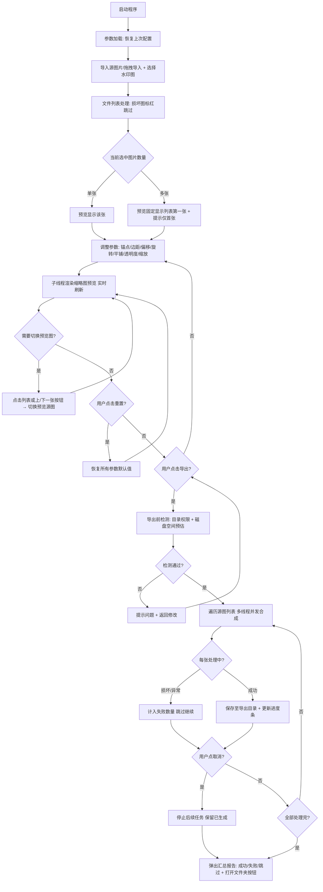

# 批量图片自动水印添加工具 – 需求文档 (v1.2)

**文档版本**：1.2  
**目标用户**：内容创作者、电商运营、摄影师、开发人员  
**技术栈**：Python 3.9+，PySide6 (Qt for Python)，Pillow (PIL)

---

## 1. 项目概述
开发一款基于 Python 的桌面端 GUI 应用程序，用于向单张或批量图片添加**图片水印**（Logo/签名图）。核心能力包括：灵活的锚点定位（含边缘边距控制）、水印旋转、多样化平铺布局、精确透明度与缩放控制、**实时预览**（批量模式下首图预览，支持画布缩放拖拽检查细节）以及一键批量异步导出。

---

## 2. 功能需求总览

| 模块 | 核心功能点 |
| :--- | :--- |
| **文件管理** | 选择源图片（多选/拖拽导入）、文件列表管理（删除单张/清空）、选择水印图片（支持取消/重新选择）、选择导出目录（支持取消/重新选择）、参数记忆 |
| **水印布局** | 单一定位（9个锚点 + 画布拖拽定位 + 4角落边缘边距 + 旋转角度） / 平铺模式（含3种子模式 + 间距精确定义） |
| **样式控制** | 全局透明度（1%~100% 整数滑动条）、水印双模式缩放（相对/绝对）+ **画布可视化拖拽缩放控制点**、重置参数一键恢复 |
| **预览交互** | 画布实时渲染 + **手动刷新预览按钮**、批量导入时默认展示第一张、画布缩放/拖拽平移/1:1像素查看、上一张/下一张切换预览 |
| **导出执行** | 批量异步处理、可取消中途导出、保留原图格式/自定义格式、覆盖/重命名/跳过三选一策略、JPEG压缩质量可调、异常图片跳过与汇总报告 |

---

## 3. 详细功能规格说明

### 3.1 图片输入模块
- **源图片选择**：支持 `*.jpg, *.jpeg, *.png, *.bmp, *.webp` 格式，支持 **Ctrl/Shift 多选**，支持**拖拽文件/文件夹到窗口直接导入**。
- **文件列表管理**：
  - 列表显示内容：文件名、分辨率、文件大小、格式；
  - 支持**右键菜单或按钮移除单张**图片；
  - 支持**一键清空**全部已选图片；
  - 损坏文件在列表中标注「× 文件损坏」并自动跳过（不阻塞其他文件导入）。
- **水印图片选择与取消/重新选择**：
  - 仅支持带透明通道的 `*.png` 格式（若用户导入无透明背景图片，系统提示「建议使用 PNG 以获得最佳叠加效果」）；
  - 选择水印图后，按钮旁显示**当前水印文件名**与缩略图预览（小尺寸，约 48×48px）；
  - 提供「**取消选择**」按钮：点击后清除当前水印图，恢复未选择状态，预览画布上水印消失；
  - 提供「**重新选择**」按钮：直接打开文件对话框替换当前水印图（无需先取消再选择）。
- **导出目录选择与取消/重新选择**：
  - 选择导出目录后，显示当前完整路径；
  - 提供「**取消选择**」按钮：清除已选路径，恢复默认路径（源目录下 `/watermarked_output`）；
  - 提供「**重新选择**」按钮：直接打开文件夹对话框替换当前导出目录。
- **参数记忆（可选）**：应用关闭时记录当前水印参数（布局模式、透明度、缩放、间距等），下次启动自动恢复上次设置。

### 3.2 布局定位模式（核心逻辑）
界面需提供单选框或切换按钮，分为两大模式：

#### 模式 A：单个水印（固定锚点）
- **锚点选择**：提供 **9 个可视化按钮**（8方向 + 中心）或预览画布上直接点击 9 宫格锚点指示器：
  - **左上** (Top-Left) / **上中** (Top-Center) / **右上** (Top-Right)
  - **左中** (Middle-Left) / **中心** (Center) / **右中** (Middle-Right)
  - **左下** (Bottom-Left) / **下中** (Bottom-Center) / **右下** (Bottom-Right)
- **角落/边缘边距控制（重点优化）**：
  - 提供统一的「**边缘边距 (Margin)**」滑动条（范围 0px ~ 500px，默认 **20px**），适用于 4 个角落和 4 条边的 8 个非中心锚点；
  - 角落锚点（左上/右上/左下/右下）：水印距离相邻两条图片边缘的距离均为该边距值（例如右上锚点：距离上边缘 Margin px，距离右边缘 Margin px）；
  - 边缘锚点（上中/右中/下中/左中）：水印距离对应图片边缘为 Margin px，另一轴方向自动居中；
  - 中心锚点：边距设置不生效（始终居中）。
- **画布拖拽定位（增强交互）**：单个水印模式下，用户可**直接在预览画布上按住水印拖拽**调整位置；拖拽后 X/Y 偏移量实时同步到下方输入框，锚点自动切换为「自定义」。
- **X/Y 轴偏移微调框**：像素单位，配合拖拽使用，支持精确数值输入；偏移量在边距基础上叠加（即：最终位置 = 锚点基准 + 边距 + 偏移量）。
- **水印旋转**：
  - 旋转角度滑块：范围 **-180° ~ +180°**，步进 1°，默认 0°；
  - 快捷旋转按钮：`↺ 90°` / `↻ 90°` / `⇅ 180°` 三个快捷操作；
  - 旋转后水印若超出图片边界，自动向内收缩位置避免裁剪。

#### 模式 B：平铺水印（重复填充）
- 启用后，忽略单个锚点与旋转参数，将水印按规律铺满整张图片。
- **3 种平铺子模式**（下拉选择）：
  1. **标准网格 (Grid)**：水印以固定行列矩阵均匀排布，无错位。
  2. **砖墙交错 (Brick/Offset)**：奇数行相对于偶数行水平偏移水印宽度的 50%，模仿砖墙结构，视觉更自然。
  3. **对角线无缝 (Diagonal)**：水印沿 45° 斜线方向错位排列（每个水印同时向右、向下偏移 50% 尺寸），适用于防止盗图的密集水印。
- **平铺间距控制**：独立滑动条控制 `水平间距 (Spacing X)` 与 `垂直间距 (Spacing Y)`：
  - 单位：**百分比（相对于当前水印缩放后的宽/高）**，范围 **0% ~ 200%**，默认 50%；
  - 0% 表示水印之间无缝紧贴（相邻水印边缘相接）；
  - 100% 表示间距 = 水印宽/高的 1 倍；
  - 水平间距对应宽度百分比，垂直间距对应高度百分比。
- **边界处理规则**：水印铺到图片边缘时，超出图片边界的部分**直接裁剪**（不缩小不报错，只保留在图内的区域）。
- **密集保护**：若平铺模式下计算出单张图片需绘制 > 5000 个水印实例，弹出警告提示「水印过密可能导致卡顿，建议调大间距或缩小水印」，用户可选择继续或取消。

### 3.3 水印透明度与缩放
- **透明度 (Opacity)**：**整数滑块**，范围 **1% ~ 100%**，步进为 1%，默认 100%。  
  *逻辑说明：100% 表示完全不透明（遮盖背景），1% 表示近乎隐形。底层实现为全局 Alpha 混合 (Pillow: `Image.blend` 或 `putalpha`)。*
- **水印缩放 (Scale)**：提供**三种缩放控制方式**（相互联动，任意一种修改后其余同步更新）：
  - **方式 1：相对缩放滑动条（默认）**：
    - 滑动条范围 **10% ~ 200%**，默认 50%；
    - 参考基准：以**源图片较短边**为参考进行等比缩放（即：水印最终宽高 = 源图短边 × 缩放百分比）；
    - 适用场景：批量处理不同尺寸图片时，水印相对大小保持一致。
  - **方式 2：绝对像素宽度输入**：
    - 数值输入框：用户直接指定水印的**目标像素宽度**（1px ~ 10000px），高度自动等比计算；
    - 适用场景：对水印大小有精确像素要求时（如电商平台要求 Logo 宽度固定 200px）。
  - **方式 3：画布可视化拖拽缩放控制点（单个水印模式）**：
    - 预览画布上，水印选中时（或始终显示）在其**4个角和4条边中点**显示 8 个可拖拽的缩放手柄（Resize Handles）；
    - 拖拽**角落手柄**：等比缩放水印（按住 Shift 可强制等比，默认拖拽角落即等比）；
    - 拖拽**边缘手柄**：仅拉伸对应边（非等比，高度或宽度单独变化）—— 提供提示「非等比拉伸可能导致水印变形」；
    - 拖拽缩放时，实时更新「相对缩放%」与「绝对像素宽度」输入框的数值，双向同步；
    - 缩放过程中，在水印旁显示浮动提示框：当前尺寸 `宽 × 高 (px)` + 缩放比例 `(xx%)`。
- **缩放保护**：若按用户设置的缩放后，水印尺寸 > 源图尺寸的 150%，自动等比缩小至源图短边的 100% 并提示（气泡提示「水印过大，已自动缩小」）。
- **水印尺寸实时显示**：在缩放控件旁，始终显示当前水印的**实际像素尺寸**（例：`当前尺寸：256 × 128 px`），方便用户确认。
- **重置参数按钮**：一键将当前界面上所有水印参数（布局模式、锚点、边距、偏移、旋转、透明度、缩放、平铺间距等）恢复为默认值。

### 3.4 实时预览画布（重点交互）
- 界面右侧/中央区域设置 **预览画布（推荐 QGraphicsView）**。
- **渲染机制**：任何参数变动时**立即**重绘（子线程渲染避免 UI 卡顿 + QPixmap 缓存）；预览使用底图缩略图（宽 ≤ 800px）以保证 < 300ms 响应速度。
- **手动刷新预览按钮**：
  - 预览区工具栏提供「🔄 刷新预览」按钮，用于**主动触发**一次重新渲染；
  - 适用场景：用户关闭自动预览模式、或参数变动后预览未及时更新、或大图希望等参数全部调好再一次性渲染时使用；
  - 按钮旁提供自动预览开关「☑ 自动实时预览」（默认开启）：关闭后仅在点击「刷新预览」按钮时才重绘，避免拖动滑块时频繁重绘导致的卡顿。
- **批量场景逻辑**：
  - 多张图片时，预览画布**默认展示列表第一张**；
  - 界面显示提示标签：`正在预览：1/10（仅展示首张效果，导出将处理全部所选图片）`；
  - 切换预览方式：
    - 点击文件列表中任意行 → 预览切换到该图；
    - 预览区上方提供「◀ 上一张」/「下一张 ▶」按钮快捷切换。
- **画布交互增强**：
  - **滚轮缩放**：鼠标滚轮在画布上滚动 → 放大/缩小预览画面（10% ~ 500%）；
  - **拖拽平移**：按住中键或空格 + 左键 → 拖动画布平移查看细节；
  - **1:1 实际像素按钮**：一键切换到 100% 缩放比例（显示真实像素效果）；
  - **适应窗口按钮**：一键恢复到「适应画布大小」模式。
- **水印拖拽定位（单个模式）**：左键按住预览图上的水印可自由拖动，松开后位置参数自动同步。
- **水印可视化缩放控制点（单个模式）**：
  - 水印周围显示 8 个缩放手柄（同 3.3 节方式3），拖拽直接调整水印大小，缩放数值同步回参数面板；
  - 手柄样式：半透明白色填充 + 深蓝色描边，大小 10×10px，确保在各种背景下可见。

### 3.5 批量导出功能
- **导出按钮**：点击后弹出进度条对话框（`QProgressDialog`），显示：
  - 当前进度：`正在处理 3/50`；
  - 当前处理的文件名；
  - **取消按钮**：用户可随时点击中止导出。
- **取消导出处理**：
  - 用户点击取消后，立即停止后续图片处理；
  - 已成功生成的文件**保留**（不删除）；
  - 弹出提示：「导出已取消，已完成 X/Y 张」。
- **命名冲突处理策略（三选一单选）**：
  1. **重命名（默认）**：原文件名 + `_wm` 后缀（如 `photo.jpg` → `photo_wm.jpg`）；若仍重名则追加序号 `_1`、`_2`…（仅在后缀后追加，避免多层嵌套）。
  2. **覆盖**：直接覆盖已存在的同名文件（弹出二次确认提示「将覆盖同名文件，是否继续？」）。
  3. **跳过**：遇到同名文件时跳过不处理，并在最终报告中标注「× 已跳过（文件存在）」。
- **格式与质量控制**：
  - 导出格式下拉选项：`与源图一致（默认）` / `JPEG` / `PNG`；
  - 选择 JPEG 时新增 **JPEG 压缩质量**滑块（范围 1% ~ 100%，默认 85%，100% 为最佳质量）；
  - PNG 转 JPEG 或强制 JPEG 导出时：原图/水印的透明区域自动填充为**纯白色**背景。
- **并发控制**：
  - 默认使用 `CPU 核心数 - 1` 个线程并发处理（最少 1 个，最多 8 个）；
  - 进阶设置中允许用户手动调整导出线程数（1 ~ 8）。
- **导出结果报告**：
  - 全部处理完成后弹出汇总对话框：
    - `成功导出：48 张`
    - `跳过（同名）：1 张`
    - `失败（文件损坏）：1 张`
  - 失败条目列出具体文件名和原因；
  - 提供「打开导出文件夹」快捷按钮。

---

## 4. 界面布局 (UI/UX) 线框描述

建议采用 **左右分栏布局**（左设置，右预览）：

| 区域 | 组件内容 |
| :--- | :--- |
| **左侧面板 (控制区)** | ① 文件导入区：拖拽区域 + 源图/水印图/导出路径按钮 + 文件列表（含删除/清空操作）<br>　→ 水印图按钮旁：【取消选择】+【重新选择】+ 水印名缩略图显示<br>　→ 导出路径旁：【取消选择】+【重新选择】+ 当前路径显示<br>② 模式切换：`单个水印` / `平铺水印` Tab 或 Radio<br>③ 单个水印 Tab：9 宫格锚点按钮 + 【边缘边距滑块】+【X/Y 偏移微调】+【旋转滑块+快捷按钮】+【画布拖拽提示】<br>④ 平铺水印 Tab：子模式下拉 + 水平/垂直间距滑块<br>⑤ 通用样式：【透明度滑块】+【缩放三种联动控制（相对%滑条+绝对px输入+当前尺寸显示）】+【重置参数按钮】<br>⑥ 导出设置：命名策略单选 + 格式下拉 + JPEG质量滑块 + 【开始导出】大按钮 |
| **右侧面板 (预览区)** | ① 顶部工具栏：◀ 上一张 / 下一张 ▶ / ◀▶ 适应窗口 / 🔍 1:1 像素 / 🔄 刷新预览按钮 / ☐ 自动实时预览开关 / 缩放比例显示<br>② 中心：大尺寸预览画布（支持滚轮缩放+中键拖拽平移+水印拖动定位+**水印8方向缩放手柄拖拽**）<br>③ 底部状态栏：当前预览文件名 / 图片尺寸 / 当前 1/10 / 待处理总数 / 进度提示 |

---

## 5. 非功能性需求

- **响应速度**：对于 4000x3000 像素的图片，预览渲染时间 < 300ms（若水印过大，需先用缩略图进行预览渲染，仅在导出时使用原图）。
- **内存管理**：
  - 批量导出时，**逐张加载处理，处理完立即释放内存**（不在内存中保留所有原图），防止 OOM；
  - 预览缩略图 LRU 缓存最多保留 5 张，超出自动释放最早的。
- **兼容性**：支持 Windows 10/11、macOS 11+、主流 Linux 发行版（基于 Python 跨平台特性）。
- **异常处理（补充完整场景）**：
  1. 水印图 > 底图 → 自动等比缩至底图短边 30%，并气泡提示「水印过大，已自动缩小」。
  2. 源图片文件损坏 / 无法解码 → 导入时标红跳过；导出过程中遇到损坏图 → 计入失败数量，不阻塞其他图片。
  3. 导出目录**磁盘空间不足** → 开始导出前检测：若剩余空间 < 预估总大小（单张平均大小 × 数量 × 1.2 倍），提前弹窗警告「磁盘空间可能不足，是否继续？」。
  4. 用户中途取消导出 → 按 3.5 节处理，保留已生成文件。
  5. 平铺过密（>5000 个水印） → 弹出警告让用户选择继续或返回调整。
  6. 导出路径无写入权限 → 导出前检测，提示「无写入权限，请更换导出目录」。

---

## 6. 技术实现选型建议

### 6.1 方案一：Python 技术栈（快速开发，适合原型验证）

| 需求 | 推荐方案 |
| :--- | :--- |
| **GUI 框架** | **PySide6** (Qt6 官方绑定) – 界面美观，信号/槽机制完美支持实时预览更新。 |
| **图像处理** | **Pillow (PIL)** – 核心的 `Image.alpha_composite`、`rotate`、`resize` 用于水印合成。 |
| **异步导出** | Python `concurrent.futures.ThreadPoolExecutor` 结合 QThread / QRunnable + 信号槽，防止界面冻结；支持通过 `Future.cancel()` 响应用户取消。 |
| **实时预览优化** | 生成底图 **缩略图** (尺寸控制在 800px 宽以内) 进行实时水印叠加运算，导出时再应用至原图；QPixmap 做双缓冲避免闪烁。 |
| **参数持久化** | PySide6 `QSettings` 或 JSON 文件保存上次使用的水印参数。 |

### 6.2 方案二：Rust 技术栈（高性能，适合正式发布 / 交付客户）⭐ 推荐用于生产

| 需求 | 推荐方案 |
| :--- | :--- |
| **GUI 框架** | **egui (eframe)** – 纯 Rust 原生、跨平台、即时模式渲染，启动极快（<300ms），控件简洁且交互定制性高；或 **slint**（声明式 UI，更美观）。 |
| **图像处理** | **image crate v0.25+** – 零 GC、SIMD 优化的图像库，支持 JPEG/PNG/BMP/WebP 全部格式，核心 API：`imageops::overlay`（叠加）、`imageops::resize`（Lanczos3 高质量缩放）、`imageops::rotate`。 |
| **水印合成（Alpha 混合）** | 手动遍历像素做 `alpha blending`，或用 `image` 配合 `imageproc` crate 做更高效的 alpha composite。 |
| **文件对话框** | **rfd (Rusty File Dialog)** crate – 调用系统原生文件/目录选择窗口。 |
| **异步批量导出** | `std::thread` 真多线程（无 GIL 限制） + `std::sync::mpsc` 通道回传进度给 UI；线程池用 `rayon` crate 自动并行。 |
| **参数持久化** | **serde + serde_json**，或 `confy`/`directories` crate 存到用户 AppData 目录。 |
| **打包交付** | Cargo 原生构建单文件 `.exe`，**无需打包工具**，最终体积 8~15MB。 |

### 6.3 Python (PySide6) vs Rust (egui+image) 关键性能对比

| 维度 | Python (PySide6 + Pillow) | Rust (egui + image) |
| :--- | :--- | :--- |
| **预览渲染（4000×3000 图）** | 300ms ~ 500ms（GIL + Pillow 单线程） | **30ms ~ 80ms**（原生 SIMD + 无 GC） |
| **50 张批量导出（4000×3000）** | 90s ~ 120s（伪多线程受 GIL 限制） | **20s ~ 35s**（真并行，CPU 100% 利用） |
| **内存峰值（50张流程）** | 300MB ~ 600MB（OOM 风险高） | **稳定 50MB ~ 120MB**（所有权系统逐张释放） |
| **程序启动速度** | 3s ~ 5s（Python 解释器 + Qt 初始化） | **< 300ms**（原生二进制，秒开） |
| **发布 EXE 体积** | PyInstaller 打包 80MB ~ 150MB（含整个 Python 运行时） | **8MB ~ 15MB**（单文件，无任何外部依赖） |
| **EXE 分发安装** | 用户需 VC++ Redistributable，易报毒 | **绿色单文件**，双击即跑，兼容性好 |
| **开发效率** | ⭐⭐⭐⭐⭐（代码快、生态成熟、调试方便） | ⭐⭐⭐（学习曲线：所有权/生命周期/borrow checker） |
| **适用阶段** | MVP 原型验证、快速迭代需求 | 需求稳定后交付给客户的正式版、批量商用 |

### 6.4 选型建议

- **需求探索期 / 功能验证阶段**：先用 **Python + PySide6** 快速把所有功能做出来跑通；
- **功能稳定后 / 需要交付客户 / 批量处理性能要求高**：**迁移到 Rust + egui + image**，保持界面逻辑一致，重写核心合成层，可获得 **3~5 倍性能提升 + 10 倍更小的发行包**。

---

## 7. 验收标准 (Acceptance Criteria)

- [ ] **AC-01**：可成功导入 1~50 张不同格式图片；列表显示文件名/分辨率/大小/格式；损坏图片标红跳过不阻塞。
- [ ] **AC-02**：单个水印 9 锚点切换准确；4 个角落锚点在默认 20px 边距下水印不贴边，与边缘间距一致；边距滑块 0~500px 调节生效。
- [ ] **AC-03**：单个水印支持画布拖拽移动位置，X/Y 偏移框同步更新；旋转 -180°~+180° 滑块和快捷 90°/180° 按钮生效。
- [ ] **AC-04**：开启平铺模式，切换 3 种子模式（网格/砖墙/对角线），填充规律符合预期；间距 0% 时水印无缝紧贴，200% 时间距为水印 2 倍尺寸。
- [ ] **AC-05**：透明度滑块 1%~100% 连续变化无跳变；两种缩放模式（相对% / 绝对px）切换与数值生效正确。
- [ ] **AC-06**：5 张批量导入 → 默认显示第 1 张预览 + 「1/5 仅展示首张」提示；点击列表或上/下一张按钮可切换预览图。
- [ ] **AC-07**：预览画布支持滚轮缩放（10%~500%）、中键拖拽平移、「适应窗口」与「1:1 像素」按钮一键切换。
- [ ] **AC-08**：导出 3 张图，进度条与处理计数正常结束，3 张输出图片水印参数与预览完全一致；命名策略三选一分别验证生效。
- [ ] **AC-09（取消导出）**：50 张导出过程中点击取消，已完成的保留，后续停止；弹窗显示「已完成 X/Y 张」。
- [ ] **AC-10（异常）**：水印图大于底图时自动缩小至短边 30% 并提示；损坏源图导出时跳过不中断，最终报告显示失败数量。
- [ ] **AC-11（性能）**：4000x3000 JPEG + 500x500 PNG 水印，单次预览重绘耗时 ≤ 300ms（参考机：8 核 / 16GB 内存）。
- [ ] **AC-12（性能基准）**：50 张 4000x3000 图片批量导出，总耗时 ≤ 2 分钟（参考机：8 核 CPU / 16GB 内存 / SSD）。
- [ ] **AC-13（重置）**：调乱全部参数后点「重置参数」，所有控件恢复到默认值，预览同步刷新。
- [ ] **AC-14（JPEG 质量）**：JPEG 导出质量 10% 与 100% 两档输出，文件大小差异明显且肉眼可见质量区别。
- [ ] **AC-15（手动预览按钮）**：关闭「自动实时预览」开关后，拖动滑块/修改参数不触发重绘；点击「🔄 刷新预览」才更新画面；重新开启自动模式后恢复实时更新。
- [ ] **AC-16（画布缩放控制点）**：单个水印模式下，水印四周显示 8 个手柄；拖拽角落手柄等比缩放，参数面板「相对%」与「绝对px」数值同步双向更新；缩放过程中显示浮动尺寸提示。
- [ ] **AC-17（取消/重新选择水印图）**：选择水印图后，显示缩略图+文件名；点「取消选择」清除水印，预览画面水印消失；点「重新选择」直接打开文件对话框替换水印，无需先取消。
- [ ] **AC-18（取消/重新选择导出目录）**：选择导出目录后，点「取消选择」恢复默认路径（源目录下 `/watermarked_output`）；点「重新选择」可更换路径。
- [ ] **AC-19（水印尺寸实时显示）**：缩放控件旁始终显示当前水印实际像素尺寸（例：256 × 128 px），缩放后数值立即更新。

---

## 8. 附录 A：版本历史

| 版本 | 日期 | 修改人 | 修改内容 |
| :--- | :--- | :--- | :--- |
| 1.0 | 2026-06-27 | - | 初始版本：基础功能定义 |
| 1.1 | 2026-06-27 | - | 核心优化：<br>① 新增 9 锚点 + 4 角落统一边缘边距（重点解决水印贴边问题）<br>② 新增水印旋转、画布拖拽定位、预览缩放平移 1:1<br>③ 新增双模式缩放（相对% / 绝对px）、重置参数按钮<br>④ 新增文件列表管理（删除/清空/拖拽导入/损坏标注）<br>⑤ 导出命名三选一策略、JPEG 质量、取消导出、结果报告<br>⑥ 完善异常处理 6 种场景、内存管理细节、并发线程控制<br>⑦ 验收标准量化补充性能 AC、边界 AC |
| 1.2 | 2026-06-27 | - | 交互增强 v2：<br>① 新增「🔄 刷新预览」手动按钮 + 「自动实时预览」开关（关闭后仅手动触发重绘）<br>② 水印缩放新增第 3 种方式：预览画布上 8 方向可视化拖拽缩放手柄（角落等比 / 边缘拉伸），与参数面板双向联动<br>③ 缩放旁新增水印实际像素尺寸实时显示（例：256 × 128 px），缩放过程中浮动提示尺寸+比例<br>④ 选择水印图后新增「取消选择」「重新选择」按钮，配合缩略图+文件名显示<br>⑤ 选择导出目录后新增「取消选择」「重新选择」按钮，取消后恢复默认输出路径<br>⑥ UI 布局线框更新（左右面板新增上述控件）<br>⑦ 新增验收标准 AC-15 ~ AC-19 覆盖上述新功能 |

---

## 9. 附录 B：术语表

| 术语 | 说明 |
| :--- | :--- |
| **锚点 (Anchor)** | 水印在底图上的对齐基准位置，9 个常见位置（4 角 + 4 边中点 + 中心）。 |
| **边缘边距 (Margin)** | 水印锚定到角落或边缘时，距离图片边缘的像素留白，避免水印贴边影响美观。 |
| **Alpha 混合 (Alpha Blending)** | 带透明度通道的图片与底图叠加的算法，控制水印「透明/不透明」程度。 |
| **平铺 (Tiling)** | 将水印按固定规律重复排列铺满整张图片的模式，常用于防盗图。 |
| **缩略图预览 (Thumbnail Preview)** | 先将底图缩小到 800px 宽以内再合成水印，用于加速实时预览；导出时才使用原图尺寸合成。 |
| **相对缩放** | 以底图短边为参考的百分比缩放，适合批量不同尺寸图片时保持水印相对大小一致。 |
| **绝对缩放** | 指定水印固定像素宽度，适合精确尺寸要求场景。 |

---

## 10. 附录 C：流程图（业务逻辑）


*本需求文档可直接交由开发团队进行技术设计与编码，也可作为开发者自研的 CheckList。*

---

## 11. 附录 D：Rust (egui + image) 项目搭建 & EXE 构建完整指南

> 🚀 **目标**：从 0 开始在 Windows 上构建出可独立分发的单文件 `.exe` 程序。

### D.1 第一步：安装 Rust 工具链（一次性操作）

1. 先安装 **Visual Studio 2022 构建工具**（Rust 需要 MSVC 链接器）：
   - 下载地址：[https://visualstudio.microsoft.com/zh-hans/visual-cpp-build-tools/](https://visualstudio.microsoft.com/zh-hans/visual-cpp-build-tools/)
   - 安装时勾选「**使用 C++ 的桌面开发**」工作负载，确保以下组件被选中：
     - ✅ MSVC v143 - VS 2022 C++ x64/x86 生成工具
     - ✅ Windows 11 SDK（或 Windows 10 SDK，与你系统匹配）
2. 安装 Rust 本身：
   - 访问 [https://rustup.rs/](https://rustup.rs/) 下载 `rustup-init.exe`
   - 双击运行，全部默认（一路回车）即可；安装会自动配置 `PATH`
3. **重启 PowerShell / 终端**，验证安装：
   ```powershell
   rustc --version    # 应输出类似 rustc 1.8x.x
   cargo --version    # 应输出类似 cargo 1.8x.x
   ```
4. （可选，加速国内依赖下载）配置 Crates 镜像：在用户目录 `C:\Users\Cheng\.cargo\` 下新建 `config.toml`，写入：
   ```toml
   [source.crates-io]
   replace-with = 'rsproxy-sparse'
   
   [source.rsproxy]
   registry = "https://rsproxy.cn/crates.io-index"
   
   [source.rsproxy-sparse]
   registry = "sparse+https://rsproxy.cn/index/"
   
   [registries.rsproxy]
   index = "https://rsproxy.cn/crates.io-index"
   
   [net]
   git-fetch-with-cli = true
   ```

### D.2 第二步：创建项目骨架（在本需求文档同级目录下）

打开 PowerShell，进入项目目录：

```powershell
cd "c:\Users\Cheng\Desktop\图片加水印工具"
cargo new watermark-tool --bin   # 创建 Rust 项目
cd watermark-tool
```

编辑 `Cargo.toml`，添加以下依赖（复制覆盖 `[dependencies]` 段）：

```toml
[package]
name = "watermark-tool"
version = "0.1.0"
edition = "2021"
description = "批量图片自动水印添加工具 (Rust + egui + image)"

[dependencies]
eframe = "0.28"                  # egui 官方桌面框架（winit + wgpu）
egui = "0.28"                    # 即时模式 GUI
image = { version = "0.25", features = ["jpeg", "png", "bmp", "webp"] }  # 图像编解码
imageproc = "0.25"               # 图像处理扩展（affine/alpha混合等）
anyhow = "1"                     # 便捷错误处理
thiserror = "1"                  # 自定义错误类型
rfd = "0.14"                     # 系统原生文件/目录选择对话框
serde = { version = "1", features = ["derive"] }
serde_json = "1"                 # 参数持久化（JSON）
directories = "6"                # 跨平台用户目录（AppData 等）
walkdir = "2"                    # 递归遍历文件夹
rayon = "1"                      # 数据并行（批量导出多线程加速）

# ---------------- Release 体积优化配置（关键） ----------------
[profile.release]
opt-level = 3        # 最高优化等级（速度 + 体积）
lto = "fat"          # 全程序链接时优化，体积显著减小
codegen-units = 1    # 单代码单元，配合 LTO 最大化优化
strip = true         # 移除调试符号与符号表
panic = "abort"      # 移除 panic 展开代码，体积更小更快
```

### D.3 第三步：最小可运行代码（验证窗口 + 选图 + 预览）

将 `src/main.rs` 替换为以下代码（具备：选择源图/水印/导出目录 + 手动刷新预览按钮 + 取消/重选 + 基础预览）：

```rust
use std::path::PathBuf;
use std::sync::Arc;

use eframe::egui;
use image::GenericImageView;

struct WatermarkApp {
    source_images: Vec<PathBuf>,
    watermark_image: Option<Arc<image::DynamicImage>>,
    watermark_path: Option<PathBuf>,
    output_dir: Option<PathBuf>,

    opacity: f32,
    scale_percent: f32,
    auto_preview: bool,
    preview_dirty: bool,
    preview_texture: Option<egui::TextureHandle>,
}

impl Default for WatermarkApp {
    fn default() -> Self {
        Self {
            source_images: Vec::new(),
            watermark_image: None,
            watermark_path: None,
            output_dir: None,
            opacity: 1.0,
            scale_percent: 0.5,
            auto_preview: true,
            preview_dirty: true,
            preview_texture: None,
        }
    }
}

impl WatermarkApp {
    fn mark_preview_dirty(&mut self) {
        self.preview_dirty = true;
        self.preview_texture = None;
    }
}

impl eframe::App for WatermarkApp {
    fn update(&mut self, ctx: &egui::Context, _frame: &mut eframe::Frame) {
        // ---- 左侧控制面板 ----
        egui::SidePanel::left("control_panel")
            .resizable(true)
            .default_width(320.0)
            .width_range(260.0..=480.0)
            .show(ctx, |ui| {
                ui.heading("🎛 控制面板");
                ui.separator();

                // --- 源图片 ---
                ui.collapsing("🖼 源图片", |ui| {
                    if ui.button("📁 选择源图片 (多选)").clicked() {
                        if let Some(paths) = rfd::FileDialog::new()
                            .add_filter(
                                "图片文件",
                                &["jpg", "jpeg", "png", "bmp", "webp"],
                            )
                            .pick_files()
                        {
                            self.source_images = paths;
                            self.mark_preview_dirty();
                        }
                    }
                    ui.horizontal(|ui| {
                        ui.label(format!("已选：{} 张", self.source_images.len()));
                        if ui.button("清空").clicked() {
                            self.source_images.clear();
                            self.mark_preview_dirty();
                        }
                    });
                });

                ui.separator();

                // --- 水印图片（含取消/重选） ---
                ui.collapsing("💧 水印图片", |ui| {
                    ui.horizontal(|ui| {
                        if ui.button("选择 PNG 水印").clicked() {
                            if let Some(p) = rfd::FileDialog::new()
                                .add_filter("PNG (透明背景)", &["png"])
                                .pick_file()
                            {
                                if let Ok(img) = image::open(&p) {
                                    self.watermark_image = Some(Arc::new(img));
                                    self.watermark_path = Some(p);
                                    self.mark_preview_dirty();
                                }
                            }
                        }
                        if self.watermark_path.is_some() {
                            if ui.button("取消").clicked() {
                                self.watermark_image = None;
                                self.watermark_path = None;
                                self.mark_preview_dirty();
                            }
                            if ui.button("重选").clicked() {
                                if let Some(p) = rfd::FileDialog::new()
                                    .add_filter("PNG (透明背景)", &["png"])
                                    .pick_file()
                                {
                                    if let Ok(img) = image::open(&p) {
                                        self.watermark_image = Some(Arc::new(img));
                                        self.watermark_path = Some(p);
                                        self.mark_preview_dirty();
                                    }
                                }
                            }
                        }
                    });
                    if let Some(p) = &self.watermark_path {
                        ui.label(format!(
                            "当前：{}",
                            p.file_name().unwrap().to_string_lossy()
                        ));
                    }
                });

                ui.separator();

                // --- 导出目录（含取消/重选） ---
                ui.collapsing("📤 导出目录", |ui| {
                    ui.horizontal(|ui| {
                        if ui.button("选择目录").clicked() {
                            if let Some(d) = rfd::FileDialog::new().pick_folder() {
                                self.output_dir = Some(d);
                            }
                        }
                        if self.output_dir.is_some() {
                            if ui.button("取消").clicked() {
                                self.output_dir = None;
                            }
                            if ui.button("重选").clicked() {
                                if let Some(d) = rfd::FileDialog::new().pick_folder() {
                                    self.output_dir = Some(d);
                                }
                            }
                        }
                    });
                    let path_display = self
                        .output_dir
                        .as_ref()
                        .map(|p| p.display().to_string())
                        .unwrap_or_else(|| "默认：源目录/watermarked_output".into());
                    ui.label(egui::RichText::new(path_display).small());
                });

                ui.separator();

                // --- 样式参数 ---
                ui.collapsing("🎨 样式参数（透明度/缩放）", |ui| {
                    let resp_opa =
                        ui.add(egui::Slider::new(&mut self.opacity, 0.01..=1.0).text("透明度"));
                    let resp_sca = ui.add(
                        egui::Slider::new(&mut self.scale_percent, 0.1..=2.0)
                            .text("相对缩放 (源短边比)"),
                    );
                    if resp_opa.changed() || resp_sca.changed() {
                        if self.auto_preview {
                            self.mark_preview_dirty();
                        }
                    }
                });

                ui.separator();

                // --- 预览控制 ---
                ui.horizontal(|ui| {
                    if ui.button("🔄 刷新预览").clicked() {
                        self.mark_preview_dirty();
                    }
                    ui.checkbox(&mut self.auto_preview, "自动实时预览");
                });

                ui.with_layout(egui::Layout::bottom_up(egui::Align::Center), |ui| {
                    ui.add_space(12.0);
                    if ui
                        .add_sized([ui.available_width(), 44.0], egui::Button::new("🚀 开始批量导出"))
                        .clicked()
                    {
                        // TODO: 调用批量导出逻辑
                    }
                });
            });

        // ---- 中央预览区 ----
        egui::CentralPanel::default().show(ctx, |ui| {
            ui.heading("👁 预览区域");
            ui.separator();

            if self.source_images.is_empty() {
                ui.vertical_centered(|ui| {
                    ui.add_space(80.0);
                    ui.label(
                        egui::RichText::new("请先从左侧选择「源图片」开始预览")
                            .heading()
                            .weak(),
                    );
                });
                return;
            }

            let src_path = &self.source_images[0];
            let render_preview = self.preview_dirty || self.preview_texture.is_none();

            if render_preview {
                match image::open(src_path) {
                    Ok(src_img) => {
                        let max_w = ui.available_width().min(1000.0) as u32;
                        let (w, h) = src_img.dimensions();
                        let ratio = (max_w as f32 / w as f32).min(1.0);
                        let dw = (w as f32 * ratio) as u32;
                        let dh = (h as f32 * ratio) as u32;
                        let disp_w = dw.max(1) as usize;
                        let disp_h = dh.max(1) as usize;

                        // TODO: 这里后续叠加水印合成，当前仅显示源图缩略图
                        let resized = src_img.resize_to_fill(
                            dw,
                            dh,
                            image::imageops::FilterType::Lanczos3,
                        );
                        let rgba = resized.to_rgba8();
                        let color_img = egui::ColorImage::from_rgba_unmultiplied(
                            [disp_w, disp_h],
                            &rgba,
                        );
                        let tex = ui.ctx().load_texture(
                            "preview",
                            color_img,
                            egui::TextureOptions::LINEAR,
                        );
                        self.preview_texture = Some(tex);
                        self.preview_dirty = false;
                    }
                    Err(e) => {
                        ui.colored_label(
                            egui::Color32::RED,
                            format!("❌ 预览加载失败：{}", e),
                        );
                        return;
                    }
                }
            }

            if let Some(tex) = &self.preview_texture {
                ui.image(tex);
                ui.label(format!(
                    "预览：{}（第 1 / {} 张，仅首张预览）",
                    src_path.file_name().unwrap().to_string_lossy(),
                    self.source_images.len()
                ));
            }
        });
    }
}

fn main() -> eframe::Result<()> {
    let options = eframe::NativeOptions {
        viewport: egui::ViewportBuilder::default()
            .with_inner_size([1280.0, 820.0])
            .with_min_inner_size([900.0, 600.0])
            .with_title("批量图片水印工具 (Rust + egui)"),
        ..Default::default()
    };
    eframe::run_native(
        "批量图片水印工具",
        options,
        Box::new(|_cc| Box::<WatermarkApp>::default()),
    )
}
```

### D.4 第四步：本地开发调试运行

```powershell
cd "c:\Users\Cheng\Desktop\图片加水印工具\watermark-tool"
cargo run            # Debug 模式编译并运行，首次编译约 3~8 分钟（下载依赖）
                     # 之后增量编译，每次修改后 <10 秒
```

> 💡 首次运行会下载几百个依赖 crate，请耐心等待；如网络慢请先配置 D.1 第 4 条的国内镜像。

### D.5 第五步：构建正式发布版 EXE

```powershell
cd "c:\Users\Cheng\Desktop\图片加水印工具\watermark-tool"
cargo build --release
```

构建完成后，输出位置：

```
c:\Users\Cheng\Desktop\图片加水印工具\watermark-tool\target\release\watermark-tool.exe
```

✅ **直接双击此 exe 即可运行**，单文件绿色无依赖，可复制给任何 Windows 10/11 用户。

### D.6 体积优化 & 分发检查清单

| 项目 | 说明 |
| :--- | :--- |
| **默认 release 体积** | 约 10~18 MB |
| **进一步缩小（可选）** | 用 `upx --best --lzma watermark-tool.exe` 压缩到 **3~6 MB**（下载 [UPX](https://upx.github.io/)） |
| **需要分发的文件** | 只需要那一个 `watermark-tool.exe`，其它 `target/release/` 下的 `.dll` 等都不需要 |
| **是否需要安装程序** | 不需要，绿色单文件；若需要安装向导可用 `NSIS` 或 `Inno Setup` 做一个安装包 |
| **杀毒误报** | 极少数情况下 UPX 压缩后会被误报，不压缩直接分发即可 |

### D.7 后续功能开发 Roadmap（对照需求文档）

按需求文档优先级，后续实现顺序建议：

1. ✅ UI 骨架 + 选图 + 取消/重选 + 基础预览（上面代码已包含）
2. 📌 **核心水印合成算法**（单个锚点模式 + 9 锚点 + 边距 + 旋转 + Alpha 混合）
3. 📌 **预览合成渲染**（缩略图上合成后展示到 egui 纹理）
4. 📌 **画布 8 方向缩放手柄**（egui `Painter` 画框 + 鼠标命中检测）
5. 📌 **水印拖拽定位**（检测鼠标是否落在水印区域 → 记录偏移 → 实时拖动）
6. 📌 **平铺模式 3 种子模式**（网格 / 砖墙 / 对角线）
7. 📌 **批量多线程导出（rayon）+ 进度条（mpsc 通道回传）**
8. 📌 **命名策略三选一 / JPEG 质量 / 结果报告弹窗**
9. 🔧 **参数持久化（serde_json + directories crate 存到 AppData）**
10. 🔧 **异常处理（磁盘空间、权限、损坏文件跳过等）**

每个模块完成后 `cargo build --release` 即可迭代出新的 exe 版本。
